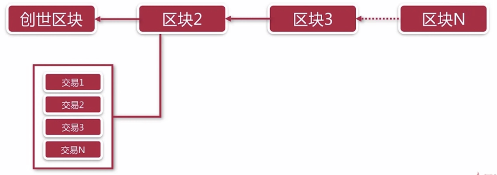

### P2P 网络协议

去中心化分布式架构，网络通讯中的所有节点都是平等的。

#### P2P 网络实现

* Hyperledger Fabric： gRPC 对等服务，满足 P2P 协议中的节点对等的概念，但不适用于大型的公有链。对于公有链而言，面临的节点数量是联盟链所不能比的，随着网络扩大 gRPC 将不再适合使用。
* Ethereum： Kad DHT 技术，使用密码学或数学的方法，将节点间的距离表现出来。

### 密码学

#### 哈希（HASH）

将不定长度的数据转换成**固定长度**的哈希值，通常被用于数学摘要，用固定长度数据代表原始数据，确保数据的真实性。
常见的哈希算法有 MD5、SHA1、SHA2 (**SHA2-256**)，其中MD5 与 SHA1 已被证明不安全。
哈希算法应满足三个特点：

* 正向快速、逆向困难：即能够迅速将数据转换成固定长度的 HASH值，而很难将 HASH 值还原成真实数据。
* 输入敏感：数据做了任何修改，产生的 HASH 值应有很大变化，以防止被利用变化差异反推真实数据变化。
* 抗碰撞：即找到两段 HASH 值一样的数据非常困难，否则该 HASH 算法毫无意义。

#### 加解密算法

* 对称加密：密钥相同、易泄露（AES、DES等），若密钥丢失，加解密将毫无意义。
* 非对称加密：公钥/私钥，公钥公开，所有人都可以知道，私钥自己保存，不在网络上流传；效率低，虽然相对安全，但效率比对称加密低得多；常用的非对称加密算法有 RSA、**椭圆曲线**等，在区块链用，使用椭圆曲线算法。

### 账本

#### 账本结构

首先有一个创世区块；N 个交易被组成一个区块，区块包括交易体和区块头，区块头包含了上一个区块或创世区块的 Hash；N 个区块组成区块链，每个区块（除了创世区块）都包含前一个区块的 Hash。

账本可以理解为一个有序的、不可篡改的状态转移记录日志，即所谓的交易，状态转移是执行交易的结果，每个交易都是通过增删改操作一系列的键值对到区块。每个区块都包含 N 个有序的交易，区块头信息包含该区块所包含的所有区块的 Hash，同时也包含前一个区块的 Hash，如此一来，账本中的所有交易都将被有序存储。所有交易有序存储，可以理解为：区块内的交易是有序存储的，区块是有序存储的，因此，所有交易都是有序存储的。

账本的交易不可能被篡改，除非破坏 Hash 链，最新区块的 Hash 值包含了自创世区块以来的所有交易，任何对中间环节的更改，都会导致最后节点的 Hash 值变得不一样，若本地节点的区块 Hash 值和其它节点的区块 Hash 值不一致，那么本地节点的区块就是无效的，将会被排斥在网络之外。

### 共识算法（分布式一致性算法）

公式算法可分为两类：

* 强一致性共识算法：一般很难实现，即使实现，性能也会很差，因为节点间会进行大量的网络通信，无法满足商用。
* 最终一致性共识算法：在确定的时间范围内达成一致即达成共识。

#### CAP 原理

一个分布式系统无法同时满足以下三个特性，只能取其二：

* 一致性（Consistency）
* 可用性（Availability）
* 分区容忍性（Partition Tolerance）

#### ACID 原理

数据库及共识算法设计的指导思想

* 原子性：每次操作都是原子的，要么成功，要么失败，不能部分成功，部分失败。
* 一致性：数据库中的状态是一致的。
* 隔离性：数据库的各种操作是隔离的，不会互相影响。
* 持久性：数据状态改变即永久改变，而不是临时改变。

#### 共识算法的两个系列

* Paxos 系列：假设分布式系统中只有故障节点（宕机、网络中断等），没有恶意节点（故意制造错误信息的节点）。
* 拜占庭容错系列：既容纳故障节点，也容纳恶意节点。

一般分布式共识使用 Paxo 算法即可解决，而区块链则需使用拜占庭容错算法。联盟链与公有链之所以不同，在技术实现上，主要是共识算法的选择不同导致的。因为联盟链有准入控制，进行拜占庭容错的必要性就相对较低，而公有链则相对较高。

#### 常见的共识算法

|          | PoW     | DPoS/PoS | PBFT   | Raft   |
| -------- | ------- | -------- | ------ | ------ |
| 场景     | 公链    | 公链     | 联盟链 | 联盟链 |
| 去中心化 | 完全    | 完全     | 多中心 | 多中心 |
| 响应时间 | 10 分钟 | 1 分钟内 | 秒级   | 秒级   |
| 容错     | 50%     | 50%      | 33%    | 50%    |

> 响应时间即达成一致共识所需要的时间，PoW 系列共识算法需要在一定时间内在全网选择一个节点进行记账，PoS 为权益代表制，参与共识的节点相对较少，相对更容易达成共识；
>
> 容错指多少比例以内的节点造假不会影响共识达成。

* PoW：工作量证明算法，比特币与以太坊使用的就是 PoW 共识算法。。

* PoS：权益证明算法，其中心思想为，谁拥有资产多，谁的话语权就大，更容易获得记账权。以太坊可能会转变成 PoS 系列算法。

