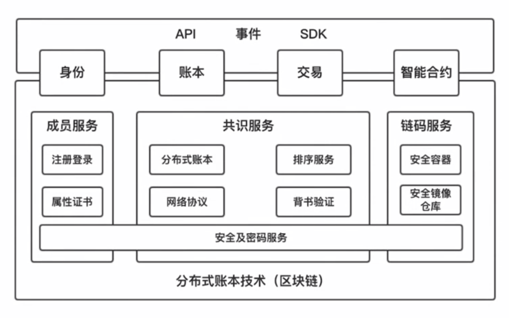

### 整体架构

* 应用程序层：API、事件、SDK、身份、账本、交易、智能合约，其中身份、账本、交易、智能合约为应用程序层与底层交互的媒介。
  * 事件：区块链是一个分布式系统，各个节点间达成一致需要消耗较长时间，因此无法使用同步模式，Fabric 使用采用异步通讯模式，我们可以在链码里定义某些事件，通过应用程序去监听，当某个时间被触发的时候就可以执行预先定义的回调函数。
  * 身份管理：身份认证操作是其它所有所有操作的拦路虎，一个不能被验明身份的请求不会被系统认可，任何请求的处理流程都是先通过请求方的签名认证，通过后才能进行下一步操作。
  * 账本管理：账本管理即对区块的查询，Fabric 提供了许多查询方式：
    * 按照区块高度进行查询，区块高度是指自创世区块开始，每个区块都有一个固定的编号，从 1 开始，每个区块都在前一个区块的基础上加 1。
    * 根据区块 hash 进行查询，每个区块都根据区块头及区块里包含的交易，根据 hash 算法生成一个唯一的区块 hash，可以理解为账本中的主键或者唯一键。
    * 根据交易 ID 来查询区块，按照常理来说交易 ID 本应只能查询交易，而不能查询区块，得益于 hash 算法的抗碰撞性，一个账本中不会存在相同的介意 ID，由此可以把交易 ID 作为索引，与交易所在的区块对应起来。
    * 根据通道的名称获取整个账本的信息，在 Fabric 中，账本是根据通道进行隔离的，而且这种隔离不仅仅体现在逻辑上，在物理存储中也进行了隔离，Fabric 的区块存储是以文件快的形式，根据通道名划分不同的文件夹，如此一来就实现了物理隔离。在存储状态数据时，因为使用的是 LevelDB，而 LevelDB 没有多个空间可供选择，所以不同的账本的状态是根据组合 key 的形式进行划分的。
  * 交易管理：账本管理提供的基本上都是查询方法，而与区块链底层做数据修改的方法都是由交易管理模块提供。上层的应用程序通过交易管理模块将交易提交到交易背书节点，在获得交易背书后，再将交易提交到排序节点进行排序，排序后的交易会被打包成区块进行分发，从而被扩散到整个网络。
  * 智能合约：只能合约的主要作用是进行只能合约的安装、初始化和更新操作。于开发者而已，智能合约是业务逻辑的声明与定义，交易是一次智能合约所编写的逻辑的调用，即智能合约是函数声明，交易时函数调用。

* 底层

  * 成员服务：应用层的身份管理模块依托于底层的成员服务模块，即联盟链特有的准入控制，利用 PKI 体系和 CA 系统提供注册登录’身份认证等功能。这里的成员或者注册登录并不是通常意义上的用户名密码形式，也不是要为每个应用程序在区块链上建立身份，而是能与区块链底层进行交互的身份管理，一个应用程序可能从头到尾只有一个身份便能完成所有与区块链交互的功能。这样的成员服务里面，每个成员都包含了多个证书，比如用于用户身份的注册证书、交易签名的交易证书以及加密传输所用的 TLS 证书。

  * 共识服务：区块链服务弱化了 CAP 中的一致性，因此需要使用良好的共识算法保证一致性。Fabric 的共识服务去其他区块链由很大不同：

    客户端（即应用程序）向背书节点发起交易提案，交易背书节点经过交易模拟执行后，把背书结果和签名返回给客户端，随后客户端将背书后的交易提交到排序节点，进行排序，最后有排序节点生成区块，并向全网进行广播，记账节点收到区块广播后，先验证区块交易的正确性，验证通过则存储到本地账本中。这个过程中使用了两种通讯协议，排序节点与组织的锚节点之间使用 gRPC 通讯，在组的内部使用 GOSSIP 协议进行区块扩散，提高了区块传输效率，GOSSIP 协议是最终一致性通讯协议，能在规定时间内在所有节点间达成数据一致。

  * 链码服务：提供了安全且隔离的交易执行环境，用于确保用户数据的隔离。

  * 安全及密码服务：Fabric 定义了 BCCSP 接口，定义了签名、加密解密等功能，默认实现了一套国际通用的密码服务，比如 SHA256、椭圆曲线算法，但在国内，如果商业项目要获得国家的认可，就要使用国密。

