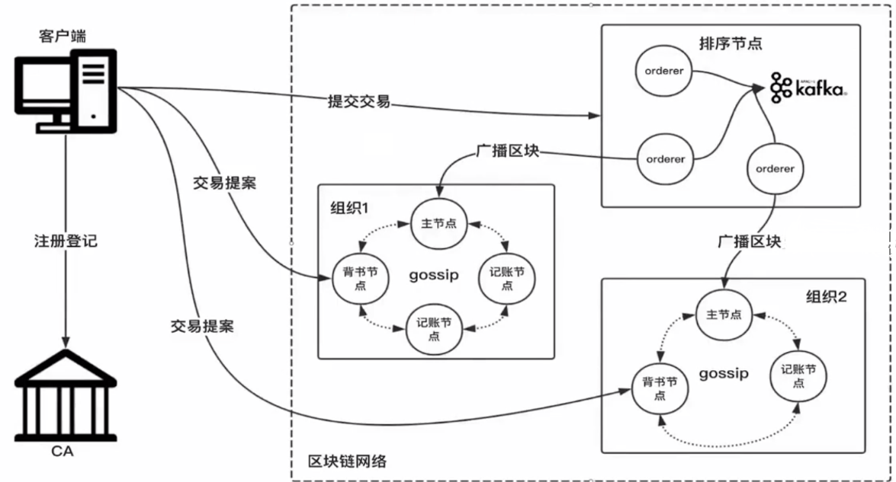

### 网络拓扑

Fabric 的网络拓扑结构相对与其它区块链而言更为复杂。比如，在比特币的网络中，只有轻节点与全节点，全节点保存了自创世区块到现在的所有区块数据，即从 2009 年到目前每隔 10 分钟都增加 1M 数据，数据量庞大，而轻节点仅仅保存了与当前账户相关的信息，相对较小。

Fabric 的网络拓扑：

* 客户端节点（应用程序/SDK/命令行工具）：应用程序与底层交互的媒介节点，不能独立存在，只有与 orderer 节点或 peer 节点连接才能发挥作用，比如连接到 orderer 节点进行通道创建，连接到 peer 节点进行交易模拟执行等。在一个基于 Fabric 的应用程序中，客户端节点不可或缺。

* Peer 节点：Peer 节点包含了 Anchor、Endorser及Committer。

  * Anchor 节点：Anchor 节点与组织紧密关联，一个组织可能拥有多个 peer 节点，但只有一个 anchor 节点，也称为锚节点或主节点，是组织内部唯一一个与 Orderer 节点进行通讯的节点。主节点可以在网络启动时在初始配置指定。如果主节点由于某种原因（宕机或者下线）不能使用，组织内部会自动选举一个 peer 节点作为新的主节点。
  * Endorser 节点：即背书节点，背书可以理解为担保，主要作用是为交易做担保。背书节点并不是一个固定的节点类型，它与 Fabric 中的智能合约绑定，每个智能合约被安装到区块链上时，都会设置其专有的背书策略，指定该智能合约的交易由哪些结点背书后才是有效的，即只有在背书节点上才会运行智能合约，如果某个节点不是背书策略里的一员，那么他就只是一个普通的 peer 节点。
  * Commiter节点：记账节点，所有的 peer 节点都是记账节点，无论它是主节点还是背书节点。记账节点的主要功能是验证从 Order 节点接收到的区块的有效性及交易的有效性，验证后记录到本地账本中，如果交易有效则会同时更改区块链上的状态数据，这个过程被称为记账。

  Peer 节点的三种类型并不是相互排斥的，一个节点可能同时是主节点、背书节点及记账节点，也可能是其中的两种或一种角色。

* Orderer 节点：排序节点，主要有两个功能：从全网的客户端接收交易，将交易按照一定的规则进行排序；将排序好的交易按照固定的时间间隔打包成区块，并分发到其它组织的主节点。目前 Fabric 有三种排序机制：

  * solo：整个网络只有一个排序节点，相当于没有共识，仅仅适合于开发和测试使用，不能使用在生产环境中，其单点故障非常严重，一旦 Oderer 无法使用，整个网络将会瘫痪。
  * kafka：在 kafka 集群中，每个 Oderer 同时是消费者和生产者，生产者把从客户端接收到的所有交易发送到 kafka 集群，消费者从 kafka 集群中获取交易。
  * pbft：拜占庭容错算法

* CA 节点（可选）：证书颁发机构，主要作用是建立区块链中的身份，只有被 CA 认可的机构才能在区块链上进行交易。可使用 Fabric 提供的 CA 组件，也可以其它第三方的权威机构，如中国的 CFCA。

客户端节点代表了基于区块链的应用程序。客户端向 CA 机构表明自己的身份，然后从机构获取相应的证书，用于后续的操作，如交易提案，交易提交等。

上图中，客户端向两个组织的背书节点发起了交易提案请求，组织1与组织2是逻辑上的概念，他们分别对应了一组 peer 节点，代表着现实生活中的两个商业主体。组织1内部有四个节点，组织2有三个节点，且都只有一个主节点。主节点负责从 Orderer 节点接收区块，然后通过 GOSSIP 协议在组织内部扩散区块。两个组织的的节点是相互独立的，并不会直接进行通信，他们共同的数据来源是排序节点。

排序节点主要有两个功能：从客户端接收交易，在排序节点内部排序后打包成区块，并广播到其它组织的主节点。上图使用 kafka，三个排序节点都直接与 kafka 直接关联，批次没有网络通信，每个组织都可以自由选择 Orderer 节点进行通信。

上图 CA 在区块链网络以外，可以认为它是第三方 CA。我们也可以使用 Fabric 官方提供的 CA，但现阶段的设计中，每个组织都有 CA 根证书，如果网络中只有一个 CA，那么就要保证这个 CA 的根证书能够被所有组织认可。

由上图可以看出，Fabric 网络不像一个网状结构，而更像树状结构，最上层为 kafka 集群，第二层为 Orderer 节点，第三层为各组织的主节点，第四层为每个组织的记账节点。如此设计的目的是什么呢？Fabric 的设计目标是企业级联盟链，企业间组网存在一个很大的问题，有得企业的网络控制比较严格，重要的数据都保存在内网中，为区块链的普及设置了很大的障碍，而 Fabric 不存在这个问题，我们可以将 Orderer 节点部署在公网中，每个企业主体只需暴露一个主节点。