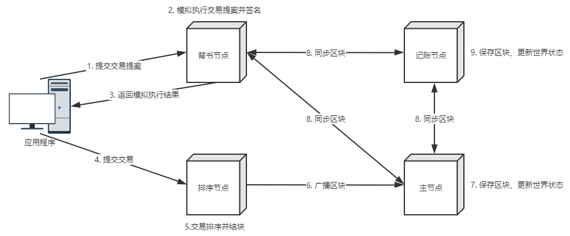

应用程序在本地构造交易提案后，选择背书节点进行提交，背书节点的选择与智能合约相关，智能合约安装时必须指定背书节点，如果智能合约要求至少需要两个背书节点进行背书，那么应用程序就需要将交易提案提交到至少两个背书节点，如果由于网络等原因，背书节点没有返回结果，那么应用程序就必须将提案发送给其它背书节点，否则该笔交易无效。提交交易提案的顺序一般没有要求，如果一切正常，所有背书节点都会返回相同结果，只是签名不一样。

背书节点模拟执行交易提案并签名。背书节点收到交易提案后，首先会对提案进行验证相关的工作，比如对交易提案格式进行验证，交易是否重复提交，交易发送者签名是否正确及发送者是否有权力提交该笔交易，如果验证通过，背书节点会将交易发送到智能合约进行隔离执行。

执行完成后对结果进行签名（即背书）并返回执行结果到应用程序。该过程是模拟执行，并不会产生任何持久化操作。

客户端收到模拟执行结果后，对消息进行验证，如果验证通过，才会进行写下一部操作。下一步操作由两种，一种是查询操作，由于查询操作并不会更改账本状态，只要验证通过，客户端节点就会将结果作为下一步业务逻辑判断的依据，可能会导致下一次交易的产生。如果该交易是写交易，客户端节点必须收集到足够多的背书结果，然后将交易提案、背书结果与自己的签名合起来作为一个交易发送到排序节点进行排序。过程中需要确保所有背书结果都一致，如果提交了背书结果不一致的交易，排序节点不会提取交易的内容，只会接收网络中的所有交易，按照预定的排序规则进行排序。排序节点排序后，将交易进行打包并广播到其它组织的主节点，主节点收到区块后，在记账过程中会验证交易是否有效，若无效，则将其标记为无效交易，该交易不会被丢弃，仍会存储到账本中，但不会更新状态数据库。因此无效交易只会浪费磁盘空间，在后续的版本中会过滤掉无效交易。