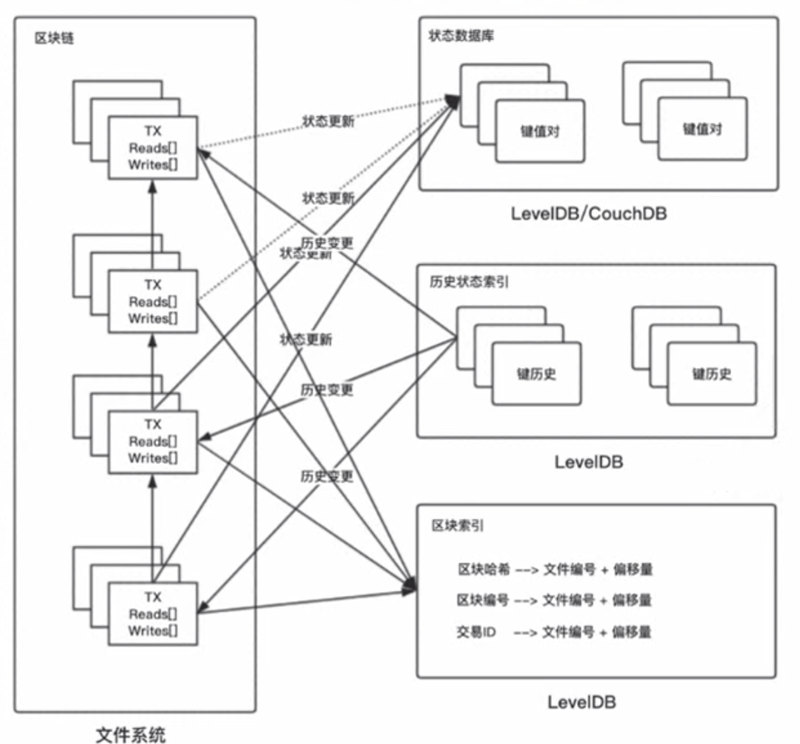

### 区块索引

区块存储于文件系统而非数据库，利用区块索引进行查询，区块索引使用 LevelDB 实现，LevelDB 是一个可以内嵌的开源数据库，以太坊使用的就是 LevelDB 作为存储引擎。基于文件系统存储的区块链，没有区块索引就无法读取区块，因为在 Fabric 的实现中，并非一个区块存储成一个文件，二十多个区块组合成文件夹进行存储，所以必须标识某个区块在哪个文件快中，偏移量是多少，否则无法读取区块。

### 状态数据库

状态可以理解为区块链上的最新数据，例如，如果做一个银行存款类似的智能合约，那么可以理解为状态数据库存储的是当前所有账户的存款余额。状态数据库随着交易的增加不断更新，且这个状态可以根据是区块进行重构，即就算状态数据库丢失，我们仍能够根据自创世区块以来的区块按照顺序重新计算出当前状态数据库的数据。状态图数据库支持 LevelDB 与 CouchDB 两种存储引擎，CouchDB 能够存储结构化数据，支持模糊查询，而 LevelDB 不支持，以上述银行存款为例，CouchDB 能够查询存款余额在 100W 以上的账户有多少个。

### 历史状态索引（数据库）

以上述银行存款为例，如果想要获得某账户的存款余额变动历史，如果没有历史状态数据库，就需要从创世区块开始查询，把每一笔相关的交易提取出来计算，此过程非常耗时。历史状态数据库并不存储状态具体变动结果，而只存储状态在哪个交易中被更新，这样做得好处是节约了存储空间。

