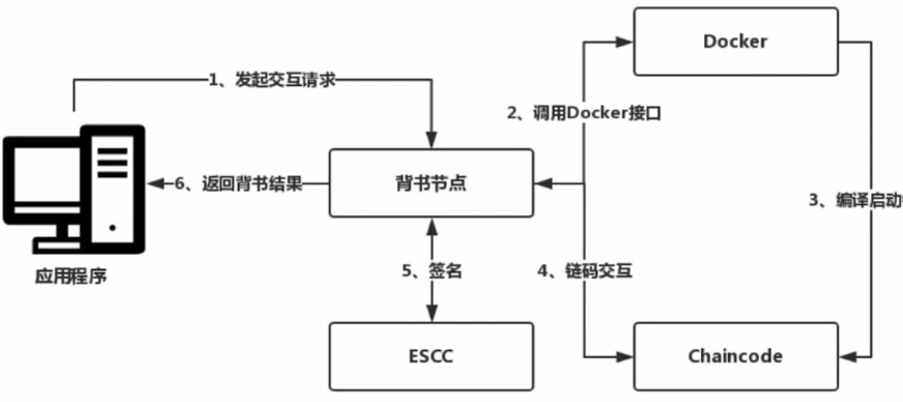

### 智能合约

智能合约最早由以太坊引入区块链领域，是区块链 2.0 的代表。

智能合约即合约协议的数字化代码表达，即把合约用代码的形式进行表达，如欠条、租房合同等。

智能合约是分布式有限状态机，在分布式系统中，如果其实状态一致，且每个状态改变的条件一致，那么最终必定会得到一致的结果。

智能合约被放在隔离的环境中执行，不受第三方干扰，即不受人的主观意识影响。以太坊使用 EVM 作为智能合约的执行环境，Fabric 则使用 Docker。

### 链码

链码是 Fabric 应用层的基石，是应用程序与 Fabric 底层交互的媒介。如果我们要基于 Fabric 开发区块链相关的项目，则必须编写链码并部署在 Fabric 上，然后基于 Fabric 提供的 SDK 编写应用程序与部署在 Fabric 上的链码进行交互。

链码在独立的 Docker 容器中执行，通过 gRPC 接口与背书节点进行连接，只有背书节点才会运行链码。

链码的生命周期：

* 打包：将编写的链码整合成一个文件，可以类比为安卓应用程序打包。
* 安装：链码安装将打包好的链码文件上传到背书接父母。
* 实例化：实例化是真正意义上的安装，实例化过程中会执行 Init 方法，做初始化操作，在链码的生命周期中，Init 方法只会执行一次。
* 升级：如果链码由更新，可以通过升级更新链码。
* 交互

### 链码交互流程

应用程序起交互请求到背书节点，背书节点收到消息后，调用容器管理模块，查看链码是否正在运行，如果没有启动，则会编译并启动容器，启动后的容器会与背书节点建立 gRPC 连接。连接建立后，背书节点把应用程序发送过来的请求转给链码执行。链码执行完成后，返回执行后的结果，背书节点收到结果后，调用 ESCC 对结果进行签名背书，并把背书结果返回给应用程序 。ESCC 是一种系统链码，主要用来完成一些系统功能。ESCC 虽然是链码，并不是运行在独立的 Docker 容器中，而是运行在节点进程中。

### 系统链码

Fabric 中的系统链码：

* LSCC（Lifecycle System Chaincode）：用于管理链码的生命周期，但不能管理链码整个生命周期，主要管理安装、实例化、升级，不能管理打包。
* CSCC（Configuration System Chaincode）：配置管理链码，主要用于某一条链的配置，比如允许新的节点加入某一条链。
* QSCC（Query System Chaincode）：主要用于查询账本存储，可以理解为一个区块索引的外部服务。
* ESCC（Endorsement System Chaincode）：交易背书链码，主要用于将交易模拟执行后的结果进行封装并签名，组装成客户端认识的交易背书结果。
* VSCC（Validation System Chaincode）：主要用于交易验证。交易被记账节点记录到账本前，需要完成有效性校验，即除了验证读写集，还需要通过 VSCC 验证。链码升级后，用老版本的链码进行交易模拟的交易是无效的。

### 链码 SDK 接口

* 参数解析
* 交易信息
* 状态操作
* 链码互操作：跨链功能
* 时间发送：在链码中完成该某操作后给客户端发送某事件

* 其它

### 链码编程禁忌

链码在分布式系统、多节点隔离执行，即同一笔交易，在区块链链网络会执行多次，执行次数取决于背书策略的选择，如可选择链上所有节点都执行，或选择某个组织的某个节点执行。要保证在不同节点执行的结果一致。可能导致结果不一致的因素：

* 随机函数：如 `rand.Int63(time.Noew()Unix())`
* 系统时间。
* 不稳定的外部依赖。