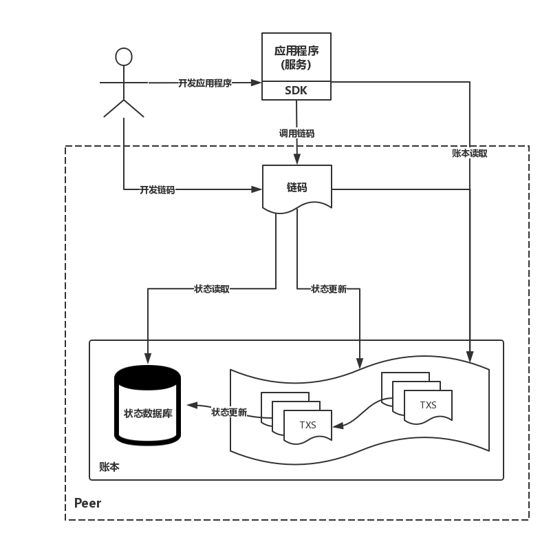

### 应用开发流程

1. 需求整理
   * 数据上链：决定哪些数据上链。由于区块链每个节点都保存了完整的数据备份，为了节省存储资源，我们需要选择性地把数据库存储到区块链上，如只存储数据的 hash，文档、图片、视频等文件不适合存储在区块链中，文件存储可以使用 ipfs。
   * 交互方法：如何与区块链交互。
2. 链码编写
3. 链码交互：使用官方提供的 client 工具只适用于开发调试，生产环境中需要使用 Fabric 提供的 SDK 与链码进行交互。

开发者编写链码与应用程序，应用程序可以调用链码及读取账本。

