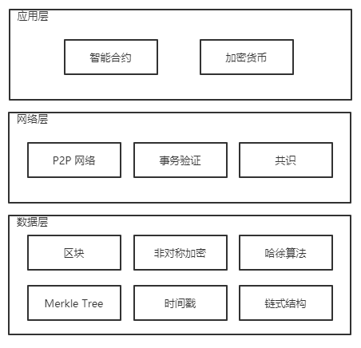
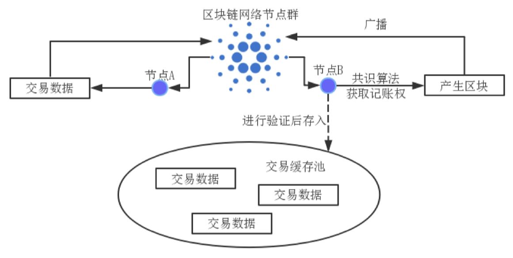

### 2.1 区块链介绍

区块链是一种**多中心**，去信任的**分布式账本**，所有参与记账的人都必须遵循基于密码学算法几张交易规则，每笔交易都会又网络各节点通过公开的密码学算法进行验证。传统单一中心化系统，攻击中心节点就能攻破整个系统，而多中心化的网络中，除非攻破一半以上的节点，否则无法破坏数据完整性。因此区块链本身结构特性和应用规则决定其具有解决信任问题的能力。

图 2.1 区块链技术结构

区块链数据是不可篡改的，这种特性是由于区块链采用单向哈希算法，每个区块都可以被验证，其中数据也可以被验证，被篡改的信息很容易检查出来，并这其他正常节点排斥。与分布式数据库不同，区块链的分布式不仅仅是分布式存储数据，还会分布式记录数据，区块链参与转集体维护记录。区块链应用了 **P2P 网络**，使得每个节点的权力和义务一致。区块链使用密码学算法包括哈希算法和公钥密码学算法。**一致性算法即共识算法，用于进行记账本的统一记录，使所有节点能够共同记录统一记账本**。

**区块链的上层应用有智能合约和加密货币**。加密货币是如比特币等数字货币，可用于交易。智能合约是通过计算机刻度代码，在判断达成一定条件时执行合约代码，应用在区块链中，由区块链本身结构为其安全背书。区块链的技术结构如图 2.1 所示。

区块链网络是一个分布式网络，用过 P2P 网络，由一组地位相等的节点构成，节点间可以直接通信，无需第三方参与。P2P 网络节点之间可以通过 IP 地址和端口号相互通信，无需第三方参与。

区块链是一个链式结构，链中的每一个区块都由哈希算法产生，每个区块都包含着在一段时间内交易的记录，每一条交易记录都由非对称加密算法进行数字签名，然后广播到所有节点，节点在验证后存入交易缓存池。通过某种共识机制决定由某个节点取得记账权，通过验证的交易记录整合为 **Merkle Tree** 并加入时间戳，产生区块头部完整区块，最后广播至所有节点。区块链整个链条包含了从该链条建立以来所有的交易。具体过程如图 2.2 所示。

图 2.2 区块链的区块生成过程

所有存在信任问题的场景都可以尝试使用区块链技术进行解决。早期加密数字货币时期，被称为区块链 1.0，用于解决数字货币信任；以智能合约解决金融领域数字资产信任，代表区块链 2.0 的到来；区块链 3.0 就是将区块链技术应用到除金融领域之外的其他领域。区块链解决交互信任问题可以分为一下三类：

1. 交易或者付款类信任问题。
2. 数据存储类信任问题。
3. 身份管理类信任问题。

### 2.3 房屋租赁场景区块链技术要求

技术选择遵循的条件：

1. 选择较为成熟的开源区块链平台。
2. 选择应用范围广、社区用户多的开源区块链平台。
3. 选择交易速度较快的开源区块链平台。

目前成熟且由大量应用的几种公链技术：

1. Bitcoin，是第一个应用区块链技术的加密数字货币。Bitcoin 十分稳定，自 2009 年第一个区块被挖出至今未发生宕机问题。Bitcoin 系统使用 POW (Proof of Work) 共识算法，资源耗费搭，不支持智能合约，是纯粹为金融而生的系统，所以不适合做深度开发。
2. Ethereum，即以太坊，是一个拥有智能合约功能的共有区块链平台。
3. Fabric，是由 Linux 基金会在 2015 年发起的， Microsoft 中热门的 **Hyperledger** 开源项目下最重要的子项目。Fabric 主要基于 **PBET** 共识算法，主要工作是构建企业级应用的区块链平台，其对象主要为交易和业务密集的金融类行业。

4. Stellar，是开源的区块链技术，主要应用与分布式金融基础架构，致力于降低金融服务的成本，例如日常支付、跨境电子汇款以及企业间的资产交易。Stellar 是共识协议 **SCP (Stellar Consensus Protocol)** 是一种围绕 “重复状态机” (Replicated State Machine，一种著名的 Raft 算法中产生的数据结构) 所设计的分布式一致性算法。这个算法不需要矿机，但是需要分布式的服务器网络来运行协议。