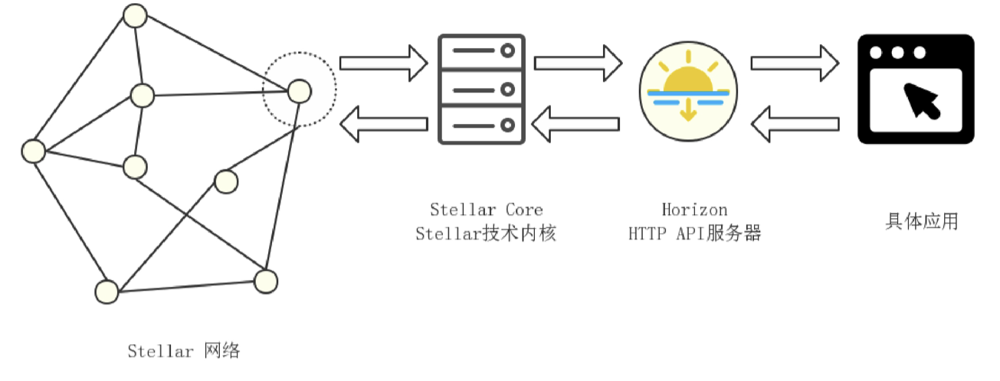
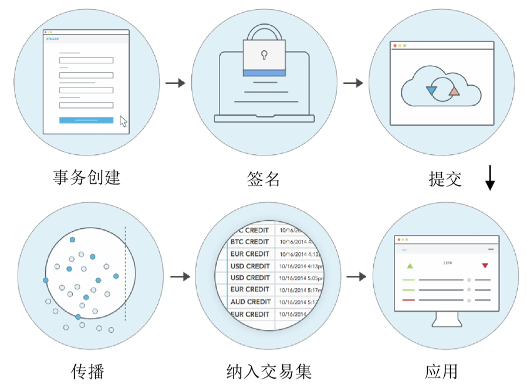

### 3.1 Stellar 节点信息

图 3.1 Stellar 网络节点数据交互图

如上图所示，在 Stellar 网络中，大多数应用都是通过 Horizon 与 Stellar 交互，它是一个 RESTful HTTP API 服务。Horizon 为用户提交交易，检查账户，以及订阅事件提供了直观的方法。每一个 Horizon 服务器都要连接到 Stellar Core (恒星网络的主干)。Stellar Core 通过恒星共识协议 (SCP) 与其它实例一道，完成验证和商定每一个交易的状态的工作。恒星网络由多个 Stellar Core 构成，有的实力提供与之通讯的 Horizon 服务，其他实例纯粹是为整个网络提供可靠性。Stellar Core 会**维护总账 (即区块链) 的本地备份**，与网络上的其它节点通讯并保持同步。另外， Stellar Core 可以**保存总账的历史信息**，以及**参与共识**。

恒星网络是一个全球性的 Stellar Core 集合，个节点由不同的人和组织维护。网络上的每笔交易会被收取一笔小费用：100stroops (0.00001 XLM)，用于防止滥用网络。

### 3.2 Stellar 恒星网络数据上链过程

账户是恒星网络的中枢数据结构，由公钥 (AccountID, 以 G 开头的 56 位 16 进制数据，又称 G 地址) 和 私钥 (Seed，以 S 开头的 56 位 16 进制数，又称 S 地址)组成。

图 3.2 Stellar 数据上链过程图

一个账户如要发起事务（Transaction，可以理解为交易），例如发起支付，那么该事务必须由此账户的公钥对应的密钥前面。如图 3.2 所示。

1. Transaction Creation (创建事务)：用户创建事务，填写所有字段，包括必填字段发起 G 地址、交易币种，可选填字段汽油费（默认 100Stroops）、备注（可选择文本、ID、哈希，默认为空）、提交时间的上下限（以秒位单位，填写正确的序列号，附上所需操作等。）
2. Signing (签名)：一旦完成交易内容，将收集所有签名并附在封包上。恒星使用签名作为授权手段。交易需要至少一个账号的授权才算生效，会有多签的情况。交易签名由密钥对事务内容进行签名得来。Stellar 使用ed25519 签名方案，同事还有机制可以使用其它公私钥签名方案，附带签名的交易被认为已获得授权。
3. Submit (提交)：签署以后，事务处于有效状态并可以发布到 Stellar 网络上。事务通常使用 Horizon 来提交，也可以直接提交到 Stellar Core 上。
4. Propagating (传播)：初步检查交易是否有效，查验资金是否可用。如果初步校验通过，那么 Stellae Core将交易传播到其连接的所有其它服务器。以这种方式，有效的交易被泛洪到整个 Stellar 网络。
5. Include in Transaction Set (纳入交易集)：在关帐 (Ledger，即区块链中区块的概念) 的时候，Stellar Core 收集上一轮关账之后发生的事务并收纳到一个集合中，之后收到的事务就先缓存起来等待下一次关账。Stellar Core 将根据其收集的交易集进行投票。SCP 算法用于解决各节点提出的不同交易集合的差异，并通过运算决定网络将使用的某一交易集。
6. Application (应用)：一旦 SCP 对某一特定事务集合取得一致，这些事务就会链接到总账上。此时会向集合中每一个介意的源账户收取费用，事务中的操作按照顺序遍历。如果有失败操作，则交易失败，之前的操作也会回滚。当集合中的所有交易完毕后，生成新账本，此过程重新开始。

### 3.3 联邦制共识，信任的基础

恒星是一个资金交换的开源协议，服务器运行实现该协议的软件，与其它恒星服务器连接而形成支付网络。而每一个服务器都存储一份此网络的所有账户的记录，这些记录被存到数据库中，称之为“总账”。**服务器都可发起要求修改总账，所有的服务器就哪一组数据被写入当前总账达成协议，这一过程被称为“共识”。**共识过程按算法规律进行，让每个服务器的总账副本保持同步和一致。这样，共识协商的规则是账本安全的保障，十分重要。若共识机制的算法有问题，轻则造成分叉，重则造成系统风险。

首先了解一下拜占庭协议/算法，其是要解决**“在存在消息丢失的情况下，试图通过消息传递的方式达到一致性是不可能”**这个问题，这就是拜占庭将军问题。

**而拜占庭容错算法 BFT、改进型实用拜占庭容错算法 PBFT 和授权拜占庭容错算法 dBFT，分别对此问题提出了解决方案。**前者通过参与分布式系统的一小部分节点来确保达成一致，尽管这是不合理的行为。一般来说，拜占庭协议制度的成员由中央机关或闭门谈判确定。中间采用少数服从多数，根据信息在分布式网络中节点间互相交换后各节点列出所有得到的信息，一个节点代表一票，选择大多数的结果作为共识。后者采用所持权益比例来选出专门的记账人（记账节点），然后记账人之间通即少数服从多数的投票机制来达成共识。

瑞波使用的是第一个拜占庭容错算法 BFT。**而恒星共识协议 SCP 是基于联邦拜占庭协议 FBA，这是另一个解决方案，引入联邦制。**差异点在于一个分布式系统里，法定体是指能满足达成一致协议的节点集合。联邦拜占庭协议BFT引入了一个**法定体的概念**，一个法定体子集能够说服特定节点达成一致。

拜占庭协议的基础：

> - 需要系统成员中所有的参与者全体达成一致。
> - 所有网络中的节点必须是已知的并且是提前认证的节点。

而联邦拜占庭协议 FBA 改进的地方是**开放的成员和拜占庭协议的非中心化控制：**

> - FBA 中每个节点选择各自的法定体丛群，整个系统的法定体结果由单个节点做出的决定所致。
> - FBA 中单个节点自己决定它们该信任哪些参与者的信息。节点们能选择多个群，并且这些单个的节点做出的选择可能依赖系统外部的标准。例如，某一特定的银行被视为信誉良好的，造成其它节点所有交易需要它的认可；某个公司与一家信用社已经保持有一种金融关系，要确保这种关系，双方同时签署所有的交易。
> - 好的法定体共享着它们的节点，致使不同法定体之间有了节点重叠，这种重叠称之为法定体交集。当法定体间没有交集时则是不相交法定体。

具体详情可参见：简书大圣2017《恒星共识协议（SCP）白皮书概论》https://www.jianshu.com/p/ba3c53e0d71f

参考文献：https://www.jianshu.com/p/b226a43dd4a5

