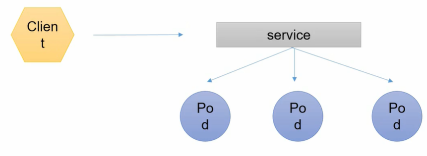
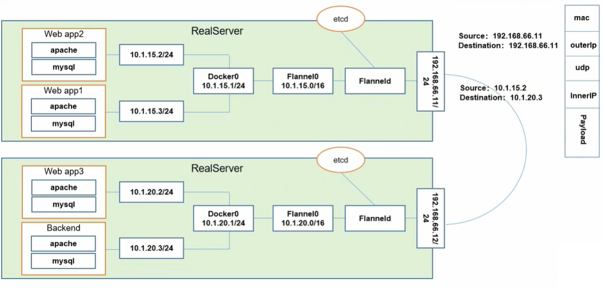

### Pod 概念

#### Pod类型

* 自主式 Pod（不被控制器管理的 Pod）
* 控制器管理的 Pod

#### Pod 控制器类型

* **ReplicationController(RC)**。Replication Controller 用来确保容器应用的副本数始终保持在用户定义的副本数,即如果有容器异常退出,会自动创建新的Pod来替代;而如果异常多出来的容器也会自动回收。在新版本的 Kubernetes中建议使用 ReplicaSe来取代 Replication Controller。

* **ReplicaSet(RS)**。ReplicaSet 他跟 ReplicationController没有本质的不同,只是名字不一样,并且  ReplicaSe支持集合式的 selector。

* **Deployment**。虽然 ReplicaSet 可以独立使用,但一般还是建议使用 Deployment 来自动管理ReplicaSet,这样就无需担心跟其他机制的不兼容问题(比如 ReplicaSet不支持  rolling-update但 Deployment支持)

  > HPA（Horizontal Pod Autoscaling）
  >
  > Horizontal Pod Autoscaling仅适用于 Deployment和 ReplicaSe,在VⅥl版本中仅支持根据Pod 的CPU利用率扩所容,在 alpha版本中,支持根据內存和用户自定义的 metric扩缩容

* **StatefulSet**。StatefulSet是为了解决有状态服务的问题（对应Deployments和ReplicaSets是为无状态服务而设计），其应用场景包括：
  * 稳定的持久化存储,即Pod重新调度后还是能访问到相同的持久化数据,基于PVC来实现（即没有 Cluster IP 的 Service）来实现。
  * 稳定的网络标志,即Pod重新调度后其 PodName和 HostName不变,基于 Headless Service
  * 有序部署,有序扩展,即Pod是有顺序的,在部署或者扩展的时候要依据定义的顺序依次依次进行(即从0到N1,在下一个Pod运行之前所有之前的Pod必须都是 Running和 Ready状态),    基于 init containers来实现
  * 有序收缩,有序删除（即从 N-1 到 0）
* **DeamonSet**。确保全部或部分Node上运行指定 Pod的副本。当由 Node 加入集群时，也会为其新增指定 Pod。当 Node 被移除，Pod 也会被回收。删除 DeamonSet 将会同时删除它创建的所有 Pod。典型用法：
  * 运行集群存储 daemon,例如在每个node上运行 glusterd、ceph
  * 在每个Node上运行日志收集 daemon,例如 fluentd、 logstash
  * 在每个Node上运行监控 daemon,例如 Prometheus Node Exporter
* **Job**。Job负责批处理任务，即仅执行一次的任务，它保证批处理任务的一个或多个Pod成功结束。
* **CronJob**。管理基于时间的Job，即：
  * 在给定时间点只运行一次
  * 周期性地在给定时间点运行

#### 服务发现

### 网络通讯方式

Kubernetes的网络模型假定了所有pod都在一个可以直接连通的**扁平的**网络空间中,这在    GCE(Google Compute Engine)里面是现成的网络模型, Kubernetes假定这个网络已经存在。 而在私有云里搭建 Kubernetes集群,就不能假定这个网络已经存在了。我们需要自己实现这个网络假设,将不同节点上的 Docker容器之间的互相访问先打通,然后运行 Kubernetes。

#### Pod 内容器之间的通讯

Pod 没有独立的 ip 地址，容器可以互相通过 localhost:port 访问，即 Pod 中容器端口不能相同（否则容器可能无法启动或无限重启）。Pod 中运行着一个 **pause** 容器，所有容器共用 pause 容器的网络栈和存储空间。

#### Pod 之间的容器通讯

Overlay Network。Flannel 是 CoreOS团队针对 Kubernetes设计的一个网络规划服务,简单来说,它的功能是让集群中的不同节点主机创建的 Docker容器都具有全集群唯一的**虚拟IP地址**。而且它还能在这些IP地址之间建立一个覆盖网络(verlay Network),通过这个覆盖网络,将数据包原封不动地传递到目标容器内。

ETCD之 Flannel 提供说明:
* 存储管理 Flannel 可分配的IP地址段资源
* 监控 ETCD 中每个 Pod 的实际地址,并在内存中建立维护 Pod 节点路由表

#### Pod 与 Service 之间的通讯

各节点的 Iptables 规则

#### 不同情况下网络通讯方式

##### 同一个Pod内部通讯

同一个Pod共享同一个网络命名空间,共享同一个 Linux协议栈

##### Pod至pod2

* Pod1与Pod2不在同一台主机,Pod的地址是与 docker0在同一个网段的,但 docker0网段与宿主机网卡是两个完全不同的IP网段,并且不同Node之间的通信只能通过宿主机的物理网卡进行。将Pod的IP和所在Node的IP关联起来,通过    这个关联让Pod可以互相访问
* Pod1与Pod2在同一台机器,由 Docker0网桥直接转发请求至Pod2,不需要经过 Flannel

##### Pod至 Service的网络
目前基于性能考虑,全部为 iptables维护和转发
##### Pod到外网
Pod向外网发送请求,查找路由表,转发数据包到宿主机的网卡宿主网卡完成路由选择后, iptables执行 Masquerade,把源IP更改为宿主网卡的IP,然后向外网服务器发送请求
##### 外网访问Pod
Service