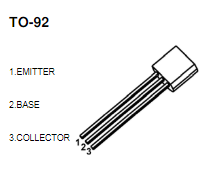

### 安装三极管 

以 [s8050](https://wenku.baidu.com/view/cf90c9b8f524ccbff12184a2.html) NPN 直插三极管为例，先看引脚图：



E 极接在电源正极，C极接地（GND），B 极接信号线。向 B 极输出高电平则三极管导通。

> 注意：不宜使用 PNP 三极管，如 s9015，PNP 三极管的 B 极接收低电平导通，会存在树莓派关机不断电时依然通电的问题。

### 安装 GPIO 库

```shell 
sudo apt-get install python3-rpi.gpio
```

### 控制代码

```python 
#!/usr/bin/python
#coding:utf8
#自动风扇控制程序，使用wiringPi的gpio命令来操作GPIO
import RPi.GPIO as GPIO
import time
#控制风扇的GPIO
FAN_GPIO = 12 # 此处使用树莓派 4B 的 pin 12 
GPIO.setmode(GPIO.BOARD)
GPIO.setup(FAN_GPIO, GPIO.OUT)
 
while True:
    # 获取CPU温度
    tmpFile = open( '/sys/class/thermal/thermal_zone0/temp' )
    cpu_temp_raw = tmpFile.read()
    tmpFile.close()
    cpu_temp = round(float(cpu_temp_raw)/1000, 1)
    print(cpu_temp)
  
    # 如果温度大于45`C，就启动风扇
    if cpu_temp >= 45.0 :
        GPIO.output(FAN_GPIO, 1) # NPN 三极管高电平导通，PNP 则相反
    # 如果温度小于40`C，就关闭风扇
    if cpu_temp < 40.0 :
        GPIO.output(FAN_GPIO, 0)
     
    time.sleep(10)

```

### 运行

可添加到[开机执行脚本](../Ubuntu/开机执行脚本.md)

```shell
nohup /usr/bin/python /opt/fan-ctl/run.py > /dev/null 2>&1 &
```

