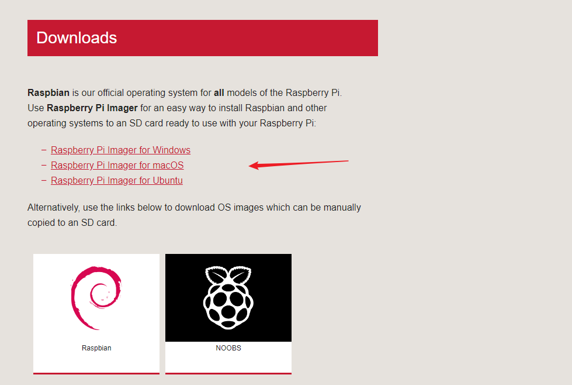
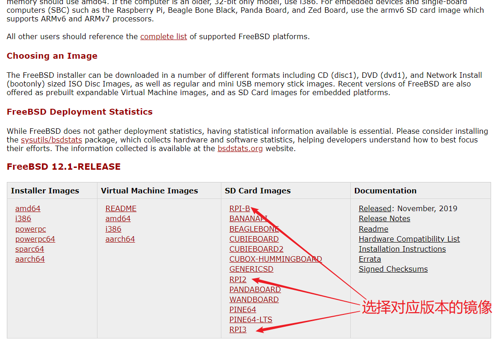
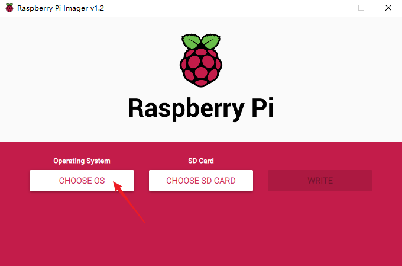
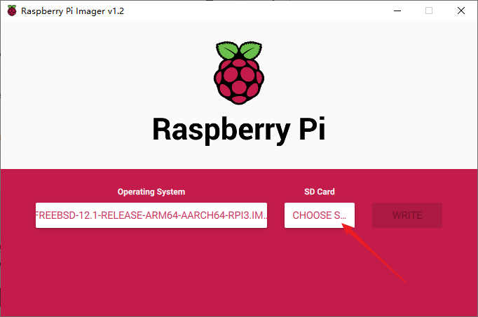
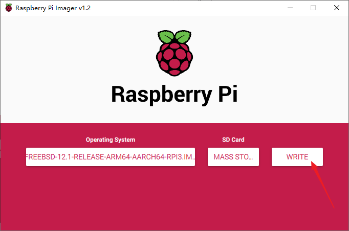

# 使用 Raspberry Pi Imager 安装 FreeBSD
### 准备工作
- 下载并安装 [Raspberry Pi Imager](https://www.raspberrypi.org/downloads/)

  

- 下载 [FreeBSD 镜像](https://www.freebsd.org/where.html)，并解压到任意目录

  
### 刷写内存卡
1. 打开安装好的 Raspberry Pi Imager，点击 "CHOOSE OS" 按钮

   

2. 点击 "Use Custom" 并选择下载好的 FreeBSD

   

3. 选择解压好的 img 镜像

   

4. 选择准备好的 SD 卡

   

5. 点击 "WRITE"，等待刷写完成

   

### 设置 SSH