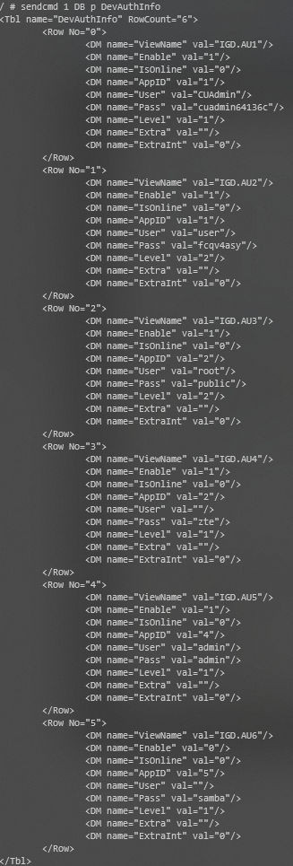
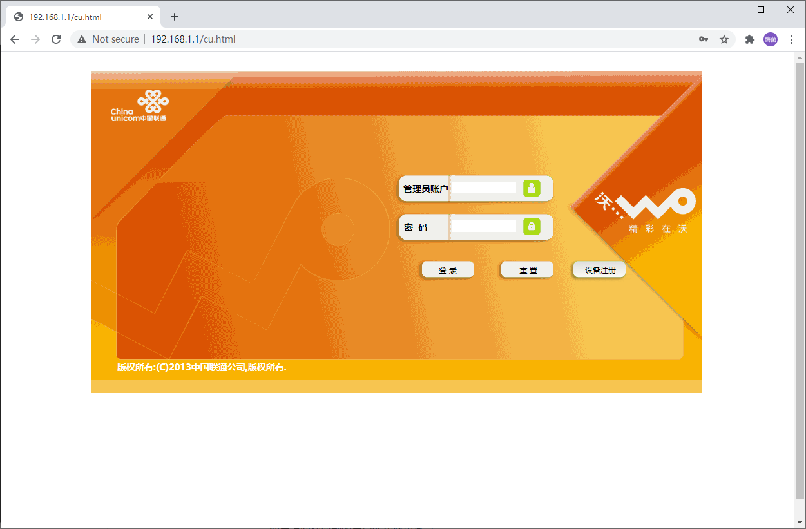
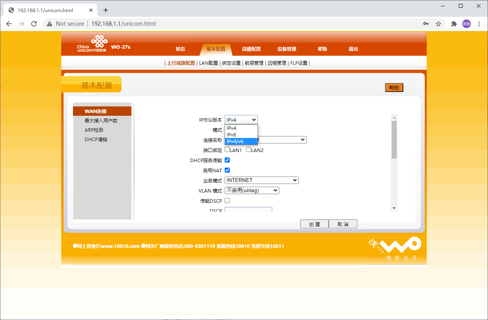
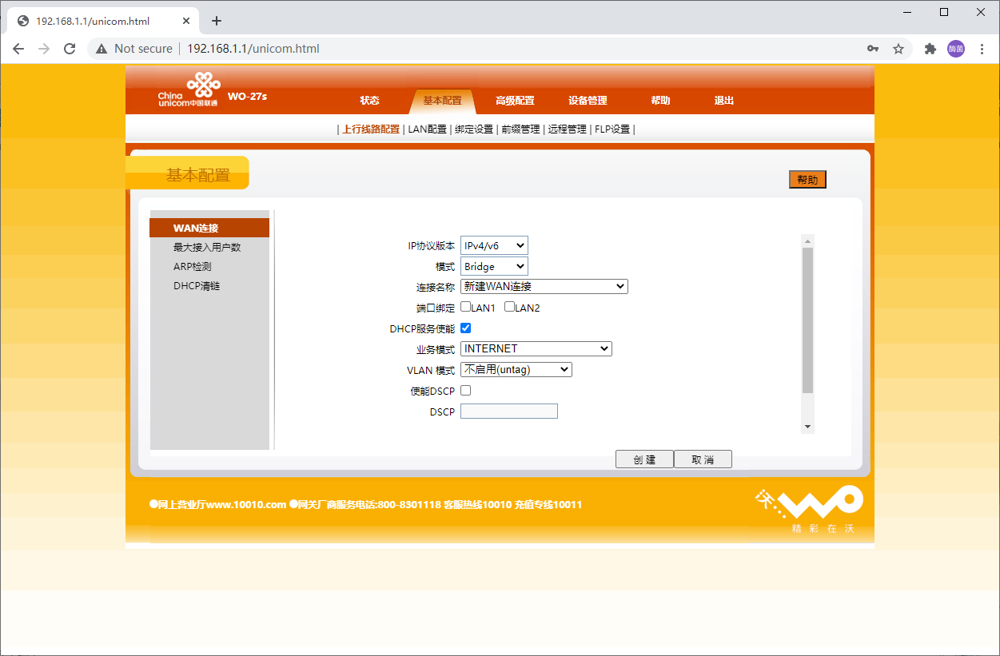

### 登录超级管理员

确保能访问广猫的 192.168.1.1

电脑 CMD，使用telnet

```shell
telnet 192.168.1.1
```

用户名 root 密码 Zte521

输入

```
sendcmd 1 DB p DevAuthInfo
```

如下图，用户名为 CUAdmin 密码为 cuadmin64136c



浏览器打开 http://192.168.1.1/cu.html

使用上面获取到的用户名和密码登录。



### 配置

基本配置 > 上行线路配置

选择 ipv4/ipv6



按下图创建



光猫配置完毕，去路由器配置拨号就OK


http://429006.com/article/technology/3405.htm